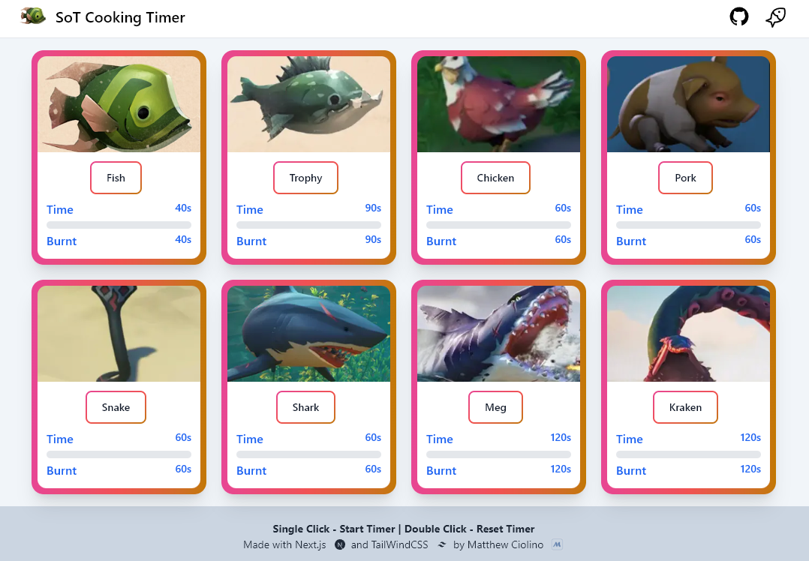

# Sea of Thieves Cooking Timer

This is a modern and responsive web application that serves as a cooking timer for the game Sea of Thieves. It provides a countdown until cooked and a countdown until burnt for various types of food in the game.

## Technologies Used

This application was built using the following technologies:

- **Next.js 15** - A React-based web framework for building server-side rendered (SSR) and static websites
- **React 18** - A JavaScript library for building user interfaces
- **TailwindCSS 3** - A utility-first CSS framework for rapidly building custom user interfaces
- **Framer Motion** - A production-ready motion library for React with powerful animations
- **@iconify/react** - A library of icons for use in web development
- **TypeScript** - A typed superset of JavaScript that compiles to plain JavaScript

## Design Features

### Modern UI/UX
- **VS Code Dark Mode Theme** - Professional dark mode inspired by Visual Studio Code's color scheme
- **Animated Border Pulse** - Dynamic border animation during countdown that travels around card edges
- **Responsive Progress Bars** - Larger, more visible progress bars with gradient fills and shimmer effects
- **Smooth Transitions** - Framer Motion animations for hover, click, and state changes
- **Status Indicators** - Pulsing dots that show active cooking timers
- **Interactive Feedback** - Scale animations on hover and click for better user interaction

### Animations
- Border pulse animation traveling around card edges during countdown
- Progress bar fill animations with shimmer effects
- Hover scale effects on cards and buttons
- Smooth transitions for all state changes
- Rotating logo animation
- Staggered card entrance animations

## Deployment

This application is deployed on Render at [Sea of Thieves Cooking Timer](https://sea-of-thieves-cooking-timer.onrender.com/).



## Features

- Modern and fully responsive design
- VS Code-inspired dark mode color scheme
- Animated countdown timers for various types of food in Sea of Thieves
- Large, reactive progress bars with gradient fills
- Single-click to start/pause a timer, double-click to reset a timer
- Real-time visual feedback with border pulse animations
- Smooth framer-motion animations throughout
- Links to the Github repo and a fishing guide for the game
- Sticky header with backdrop blur effect

## Usage

To use this application, simply click on one of the food items on the main page to start its corresponding timer. Single-click again to pause, and double-click to reset the timer. The countdown will show the time until the food is cooked and the time until the food is burnt with beautiful animated progress bars.

## Development

```bash
# Install dependencies
npm install

# Run development server
npm run dev

# Build for production
npm run build

# Start production server
npm start
```

## Acknowledgments

- The game Sea of Thieves was developed by Rare and published by Xbox Game Studios.
- The fishing guide used in this application was created by Reddit user /u/WarriorIv0ry and can be found [here](https://i.imgur.com/JduEMsl.png).

## Author

This application was created by Matthew Ciolino. Visit [My Portfolio](https://www.matthewciolino.com/) to learn more.
